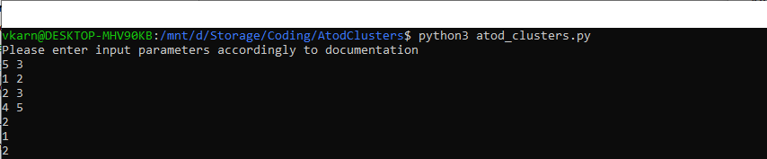

# Atod clusters
This is solution for the challenge from technical part evaluation for robotics course.
Unfortunately, **I haven't recieved any other tasks/files except "Atod clusters"**. 
But I will be happy to solve any other challenge if needed, as well.

You can find original description of the task in the file _task_desciprion.pdf_ in the repository.

# Files
- _atod_clusters.py_ - file with the solution
- _tests.py_ - tests suit for the solution
- _task_description.pdf_ - original task description in PDF format
- _README.md_ - documentation

# How to run?
To execute code you need to run atod_clusters.py and enter input values line by line.
No any additional requirements except Python.
See how it should look like on the screenshot below:

Tested using python3.7 and python3.10.

# Tests
You can find tests suit in tests.py file. Just execute this file using python 
and it will show if anything is wrong.  You can try to break the code.

# How to read the code?
In the end of the _atod_clusters.py_ file you may find execution entry point.
This if statement is responsible for input parsing 
(using utility _parse_two_numbers_ from the top of the file) and delegating further execution to
_find_atod_clusters_ function which contains all the logic.
You can also find helpful docstring for statements which can be unclear.
